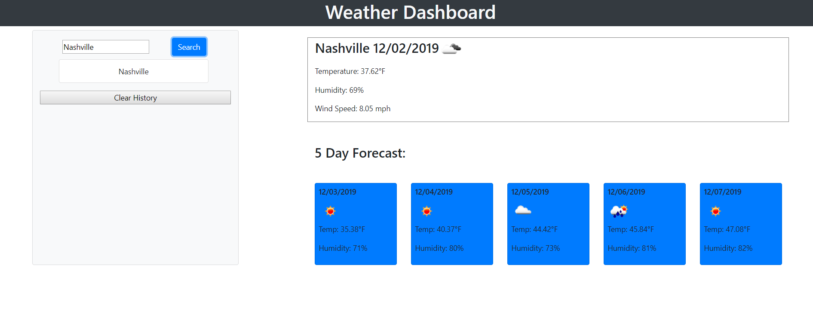

# Weather-Dashboard
A simple weather dashboard application, that shows you the current weather and 5 day forecast of whatever city the user inputs.

# Screenshot of application

# Built With
* HTML
* CSS
* Openweathermap api
* Javascript
* Bootstrap

# Functionality
The application allows the user to input a city, the dashboard will then display the current weather for that city, and a followinhg 5 day forecast for it as well. After the user inputs a city, it is saved into a search history, in which each searched city can be clicked on again to perform the current weather and 5 day forecast for whichever city you have clicked on.

# Author 
Cassidy Fortner
